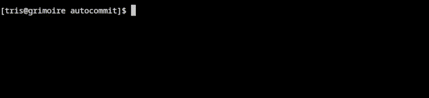
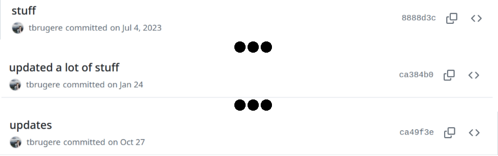

Autocommit: automatically write commit messages
===============================================

.. Shields

.. image:: https://img.shields.io/pypi/v/git_autocommit_hook
    :alt: PyPI - Version
    :target: https://pypi.org/project/git-autocommit-hook/
.. image:: https://github.com/tbrugere/autocommit/actions/workflows/ci_cd.yaml/badge.svg?branch=main
    :alt: CI/CD status
    :target: https://github.com/tbrugere/autocommit/actions/workflows/ci_cd.yaml
.. image:: https://codecov.io/gh/tbrugere/autocommit/graph/badge.svg?token=REjhBU81RH 
    :alt: Coverage percentage
    :target: https://codecov.io/gh/tbrugere/autocommit
.. image:: https://img.shields.io/badge/documentation-green?logo=readme
    :alt: Documentation
    :target: https://tristan.bruge.re/documentation/autocommit/

.. End shields

Uses the `Mistral api <https://mistral.ai/>`_ to pre-generate a commit message for you.

Features
--------

- Uses Retrieval-Augmented Generation (RAG) to give context to the LLM.
- Automatically pre-fills commit messages using git hooks.
- Optionally uses the mistral function-calling API to let the model access other files in the codebase (disabled by default).

Setup
-----

You can simply install autocommit using pip:

.. code-block:: console

    $ pip install git_autocommit_hook

Usage
-----

To use autocommit, you will need a Mistral API key. You can get one by signing up on the `Mistral website <https://mistral.ai/>`_, and then creating one from `the console <https://console.mistral.ai/api-keys/>`_.

Then, you can simply run the following command in the root of your repository:

.. code-block:: console

    $ autocommit setup --key-file <path-to-mistral-api-key>

This will 

- create a ``.autocommit_storage_dir`` (untracked) directory in the root of your repository with the RAG database and the Mistral API key.
- add a git hook to your repository to automatically generate commit messages.
- add a git hook to your repository to keep the RAG database up-to-date.

Why ?
-----

    This is why
